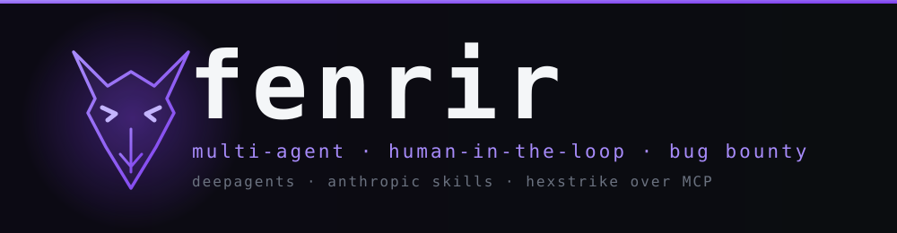

<p align="center">
  
</p>

# fenrir

A multi-agent, human-in-the-loop assistant for bug bounty / web pentesting. An orchestrator scopes the engagement and delegates to recon, web, exploit, and triage specialists, each following vendored methodology playbooks and driving 150+ security tools over MCP.

> ⚠️ **Authorized testing only** — fenrir refuses any target not listed in `scope.md`, and every offensive tool call pauses for your approval. It is **not** autonomous. Only use it within a bug bounty program's scope or an engagement you have written authorization for. Unauthorized scanning or exploitation may violate local laws.

## Features
- Five agents on [deepagents](https://docs.langchain.com/oss/python/deepagents) — orchestrator + `recon` / `web` / `exploit` / `triage`, each with its own model, tool belt, and prompt
- 30 vendored [Anthropic Cybersecurity Skills](https://github.com/anthropics/anthropic-cybersecurity-skills) as methodology (OWASP WSTG, SQLi, SSRF, IDOR, request smuggling, …)
- Tool belt from [HexStrike AI](https://github.com/0x4m4/hexstrike-ai) over MCP — nmap, nuclei, ffuf, sqlmap, subfinder, katana, dalfox, and ~140 more
- `scope.md` enforcement via an `in_scope` tool every agent must call before touching a target
- Human-in-the-loop gate — `execute` and every traffic-sending tool interrupt for approve/reject
- Free-tier LLMs only — Gemini, Groq, OpenRouter `:free`; routing is one table in `config.py`
- Three ways to drive it: terminal REPL, streaming HTTP API, or a Next.js web UI (GSAP)
- Degrades gracefully — with HexStrike unreachable, agents fall back to guidance-only

## Requirements
- Python 3.13+ and [uv](https://docs.astral.sh/uv/)
- At least one LLM key: `GOOGLE_API_KEY`, `GROQ_API_KEY`, or `OPENROUTER_API_KEY` (all have free tiers)
- Optional: Node 18+ for the web UI
- Optional: a running [HexStrike](https://github.com/0x4m4/hexstrike-ai) server for the tool belt

## Installation
```bash
git clone https://github.com/DaviAlcanfor/fenrir.git
cd fenrir
uv sync
cp .env.example .env            # add your LLM key(s)
cp scope.md.example scope.md    # define what is in scope
```

## Usage

### Terminal
```bash
uv run fenrir
```
Drops into a REPL. Point it at your `scope.md`, then ask it to recon, test a surface, or write up findings. Gated tool calls prompt `approve? [Y/n]`.

### HTTP API
```bash
uv run fenrir-api               # http://localhost:8000
```
| Endpoint | Body | Description |
|---|---|---|
| `GET /health` | — | agent readiness |
| `POST /chat` | `{message, thread_id?}` | start / continue a run (SSE) |
| `POST /threads/{id}/resume` | `{decisions}` | answer a gated tool call (SSE) |

SSE events: `thread`, `message`, `interrupt`, `error`, `done`.

### Web UI
```bash
uv run fenrir-api                                   # in one terminal
cd web && cp .env.local.example .env.local
npm install && npm run dev                          # http://localhost:3000
```

### Configuration
| Variable | Default | Description |
|---|---|---|
| `GOOGLE_API_KEY` / `GROQ_API_KEY` / `OPENROUTER_API_KEY` | — | provider keys, read from `.env` |
| `HEXSTRIKE_SERVER` | `http://localhost:8888` | HexStrike API URL |
| `HEXSTRIKE_MCP_PATH` | `../hexstrike-ai/hexstrike_mcp.py` | MCP bridge script |
| `REQUIRE_APPROVAL` | `true` | set `false` to run gated tools unattended (don't) |

Model routing is the `MODELS` table in [src/fenrir/config.py](src/fenrir/config.py) — edit it to change which model an agent uses.

## Layout
| Path | What |
|---|---|
| `src/fenrir/config.py` | paths + `Agent` / `Model` enums + `MODELS` routing table |
| `src/fenrir/settings.py` | `Settings(BaseSettings)` — keys, HexStrike URL/path, `require_approval` |
| `src/fenrir/subagents.py` | `SubAgentSpec` + `make_subagents(tools)` |
| `src/fenrir/{tools,mcp,agents,cli,server}.py` | scope tool, HexStrike belt, assembly, REPL, API |
| `src/prompts/` | one prompt `.md` per agent |
| `src/skills/` | 30 vendored `SKILL.md` playbooks |
| `web/` | Next.js chat UI with GSAP, client of `fenrir-api` |
| `tests/test_fenrir.py` | `uv run python tests/test_fenrir.py` |

See [AGENTS.md](AGENTS.md) for the architecture and the rules the agents follow.

## Dependencies
| Package | Purpose |
|---|---|
| `deepagents` | orchestrator + subagents, skills, filesystem, human-in-the-loop |
| `langchain-mcp-adapters` | HexStrike tools over MCP |
| `langchain-google-genai` / `langchain-groq` / `langchain-openrouter` | LLM providers |
| `pydantic-settings` | typed settings from `.env` |
| `fastapi` + `uvicorn` | streaming HTTP API |
| `pyfiglet` | CLI banner |
| `next` + `react` + `gsap` + `@gsap/react` | web UI (in `web/`) |

## License
MIT — see [LICENSE](LICENSE).
